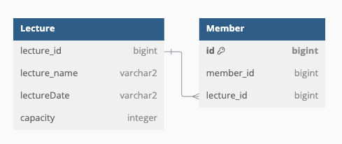

# 항플 2주차



### Lecture Table

```sql
CREATE TABLE LECTURE (
	LECTURE_ID BIGINT NOT NULL,
	LECTURE_NAME VARCHAR2(100),
	LECTURE_DATE VARCHAR2(20),
	CAPACITY INTEGER,
	PRIMARY KEY (LECTURE_ID)
)
```

- 강의 테이블
    - PK값인 LECTURE_ID를 가진다.
    - LECTURE_DATE를 VARCHAR2로 가져간 이유는 단순 일자 조회이기 때문에 ‘20241003’ 이런식으로만 가지고 있으면 충분하다고 생각을 했다.
    - CAPACITY를 다른분들은 신청자가 있을때마다 +1로 해주는 분들이 많던대 여기에서는 그냥 단순히 수강 정원. 즉 최대 수강인원(해당 프로젝트에서는 30명)을 저장해둔다.
    코드에서 따로 지정해서 저장해줄 수도 있음

### Member Table

```sql
CREATE TABLE MEMBER (
	ID BIGINT NOT NULL AUTO_INCREMENT,
	MEMBER_ID BIGINT NOT NULL,
	LECTURE_ID BIGINT,
	PRIMARY KEY (ID)
)
```

- 수강생 테이블
    - PK값인 ID값을 가진다.
    - FK를 LECTURE_ID로 설정해준다.
        
        ```sql
        ALTER TABLE LECTURE
        ADD CONSTRAINT fk_member_lectuer_id
        FOREIGN KEY(LECTURE_ID)
        REFERENCES MEMBER(LECTURE_ID);
        ```
        
    - 수강생이 정상적으로 특강을 신청 성공하게 되면 해당 테이블에 차곡차곡 쌓이게 됩니다.
